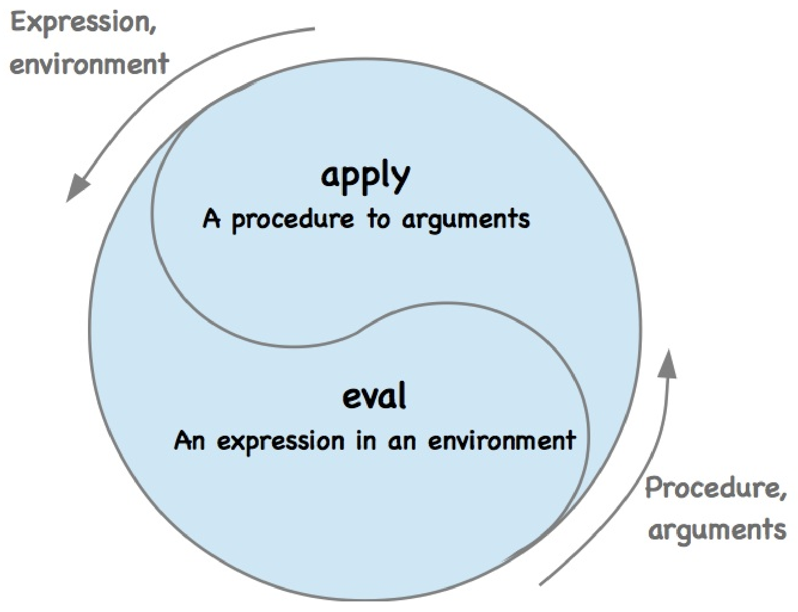

<!--
 * @Descripttion: 
 * @Version: 1.0
 * @Author: ZhangHongYu
 * @Date: 2022-07-04 17:31:00
 * @LastEditors: ZhangHongYu
 * @LastEditTime: 2022-07-07 15:14:04
-->
<p align="center">

</p>

<div align="center">

# TinySCM: Python实现的迷你Scheme解释器

[](https://github.com/orion-orion/TinySCM)[](https://github.com/orion-orion/TinySCM/blob/main/LICENSE)[](https://github.com/orion-orion/TinySCM)
<br/>
[](https://github.com/orion-orion/TinySCM) [](https://github.com/orion-orion/TinySCM)
</div>

## 1 简介

[TinySCM](https://github.com/orion-orion/TinySCM)是一个Python实现的迷你Scheme解释器, 主要参考了巫师书（the Wizard Book）[《SICP》](https://web.mit.edu/6.001/6.037/sicp.pdf)和UC Berkeley的同名课程[CS 61A](https://inst.eecs.berkeley.edu/~cs61a/sp21/)。支持词法（lexical）/动态（dynamic）作用域、宏(macro)、流/惰性求值、尾递归。

该解释器按照**读入-求值-打印循环（read-eval-print loop, REPL）** 模式运作。其中读入部分包括了包括**词法分析（lexical analysis）**和**语法分析（syntactic analysis）** 两个流程，如下图所示：

<p align="center">

</p>

词法分析模块线性扫描用户输入的字符串并将其转换为tokens流，语法分析模块则对tokens流进行递归下降的解析并将其转换为抽象语法树（abstract syntax tree, AST）。

**表达式求值（expression evaluation）** 部分的本质则是一个如下图所示的eval-apply循环：

<p align="center">

</p>

其中eval部分负责在给定环境（environment）下对表达式求值，apply部分负责将过程应用于实参（arguments）。在具体实现上，环境即是一张存储有变量与其值绑定（bindings）的表，eval会在给定环境下对组合式的运算符（operator）和运算对象（operand）部分进行递归地求值。而apply会先将实参绑定到过程的形参（parameters），然后在所得到的新环境下对过程进行求值。

具体地，我们实现的`scheme_eval`和`scheme_apply`这两个主函数（分别对应Scheme中的`eval`和`apply`这两个原始过程（primitive procedures））实现可参见`eval_apply.py`文件。

>在**元语言抽象（metalinguistic abstraction）** 的模型下，数据和程序本无分别，它们就如同咬住自己尾巴的衔尾蛇，可以互相转换，生生不息。我们将程序看做是一种抽象的（可能无穷大的）机器的一个表述，那么解释器就可以看做是一部非常特殊的机器，它要求以一部机器的描述作为输入，并模拟被描述机器的执行过程。按照这一观点，任一解释器都能模拟其它的解释器。

## 2 环境依赖

我本地的Python版本为3.9.13。

## 3 使用方法

### 3.1 打印表达式求值结果

运行`tiny_scm.py`可进入REPL循环:

```bash
$ python tiny_scm.py
scm> 
```
TinySCM可以求值的表达式类型非常多，下面我们针对几种最有趣的特性，也就是词法/动态作用域、宏、惰性求值/流、尾递归优化来举例。更多的测试用例可参见项目`tests`目录下的`tests.scm`文件，额外的用户自定义过程可参见项目`tests`目录下的`user_def.scm`文件。

**词法作用域/动态作用域**


所谓词法作用域，一言以蔽之，也即在过程中遇到自由变量时，要去本过程**定义时**的环境中查询（即是著名的LEGB规则：Local scopes -> Enclosing -> Global -> Built-in）。TinySCM的`lambda`表达式默认采用词法作用域规则。示例如下：
```scheme
scm>  (define (make-withdraw balance)
            (lambda (amount)
                (If (>= balance amount)
                        (begin (set! balance (- balance amount))
                               balance)
                        "Insufficient funds")))
make-withdraw
scm> (define W1 (make-withdraw 100))
w1
scm> (define W2 (make-withdraw 100))
w2
scm> (W1 50)
50
scm> (W2 70)
30
scm> (W2 40)
"Insufficient funds"
scm> (W1 40)
10
```

所谓动态作用域，一言以蔽之，即在过程中遇到自由变量时，去函数**调用时**的环境中查询。 在TinySCM中，你可以使用`dlambda`表达式来完成动态作用域功能。
```scheme
scm> (define f (dlambda () (* a b)))
f
scm> (define g (lambda () (define a 4) (define b 5) (f)))
g
scm> (g)
20
```
**宏**

宏是Lisp最令人兴奋的特性之一。所谓宏，就是能够在**编译期**生成代码的函数。这个函数接收Lisp代码（序对构成的表），并对这些代码片段做操作，最终生成新的Lisp代码（序对构成的表）供后面的程序在**运行期**调用。正如Paul Graham在《黑客与画家》一书中说：

> *Lisp 并不严格区分读取期、编译器、运行期。在编译期去运行就是宏，可以用来扩展语言*。

感兴趣的童鞋可以进一步查看这篇文章进行了解：[《由浅入深学习 Lisp 宏之理论篇》](https://liujiacai.net/blog/2017/08/31/master-macro-theory/)。在TinySCM中，你可以使用`define-macro`特殊形式来定义宏。示例如下：

```scheme
scm> (define-macro (for params iterable body)
         (list 'map (list 'lambda (list params) body) iterable))
for
scm> (for i '(1 2 3)
        (print (* i i)))
1
4
9
(undefined undefined undefined)
```
在上面这个例子中宏`define-macro`在编译期对传入的代码，也即符号`i`和表`'(1 2 3)`进行处理（注意，这里的`'`表达式非常重要）并生成了新的表（代码），也即`(list 'map (list 'lambda (list params) body) iterable))`。然后展开后的代码就会被做为真正用于求值的代码进行求值。

在编写宏相关的代码时，一定要注意宏接收的是符号（代码），比如我们看下面这个例子：
```scheme
scm> (define x 1)
x
scm> (define-macro (print-demo params) (print params))
print-demo
scm> (print-demo x)
x
```
这里打印的是符号`x`本身，而不是数字1。

**流/惰性求值**

所谓流，就是使用了惰性求值技术的表。它初始化时并没有完全生成，而是能够动态地按需构造，从而提升程序的计算和存储效率。

在TinySCM中，我们流的实现基于一种称为`delay`的特殊形式，对于`(delay <expr>)`的求值将不会对表达式`<expr>`求值，而是返回一个称为延时对象的Promise对象，它可以看做是对在未来的某个时间求值`expr`的允诺。和`delay`一起的还有一个称为`force`的基本过程，它以一个延时对象为参数，执行相应的求值工作，也即迫使`delay`完成它所允诺的求值。

`stream-cons`是一个特殊形式，其定义`cons-stream <x> <y>`等价于`(cons <x> (delay <y>))`，这就表达式我们将用序对来构造流。示例如下：

```scheme
scm>  (define (stream-enumerate-interval low high)
        (if (> low high)
            nil
             (cons-stream
              low
              (stream-enumerate-interval (+ low 1) high))))
stream-enumerate-interval
scm> (stream-enumerate-interval 10000 10005)
(10000 . #[promise (not forced)])
```
`strean-cdr`定义为`(define (stream-cdr stream) (force (cdr stream)))`，也即选取有关序对的`cdr`部分，并求值这里的延时表达式，以获得这个流的后面部分。示例如下：

```scheme
scm> (force (stream-cdr (stream-enumerate-interval 10000 10005)))
(10001 . #[promise (not forced)])
scm> (force (stream-cdr (force (stream-cdr (stream-enumerate-interval 10000 10005)))))
(10002 . #[promise (not forced)])
```

同样，`map`/`reduce`/`filter`算子也可以作用于流：

```scheme
scm>  (define (stream-enumerate-interval low high)
                                 (if (> low high)
                                         nil
                                         (cons-stream
                                          low
                                          (stream-enumerate-interval (+ low 1) high))))
stream-enumerate-interval
scm> (stream-map (lambda (x) (* 2 x))  (stream-enumerate-interval 10000 10005))
(20000 20002 20004 20006 20008 20010)
```

按照Scheme标准，流经过`map`/`reduce`/`filter`算子作用得到的也应该是一个惰性的流，不过我们这里做出了简化，直接将其完全求值了。


**尾递归**

所谓尾递归，就是当计算是用一个递归过程描述时，使其仍然能够在常量空间中执行迭代型计算的技术。

尾递归优化的前提是递归调用是整个函数体中最后执行的语句，且它的返回值不属于表达式的一部分，这样就无需保存返回值，从而在常数空间内执行迭代型计算。用TinySCM进行尾递归计算的示例如下：

```scheme
scm> (define (sum n total)
       (if (zero? n) total
         (sum (- n 1) (+ n total))))
sum
scm> (sum 1001 0)
501501
```

## 3.2 打印表达式的抽象语法树

要想打印表达式的抽象语法树，在运行时`tinypy.py`时添加`--ast`选项声明即可：

```python
$ python tiny_scm.py --ast
scm> (+ (* 3 (+ (* 2 4) (+ 3 5))) (+ (- 10 7) 6))
(+ (* 3 (+ (* 2 4) (+ 3 5))) (+ (- 10 7) 6))
```

可以看到，Scheme代码所产生的抽象语法树和其表达式没有任何区别。这就是Lisp的又一绝妙特性——代码本身就是抽象语法树。而这一特性就使得为Lisp写Parser非常简单，这也算是为思想镶嵌在重重括号之间的Lisp程序员的一种补偿吧Haha。
